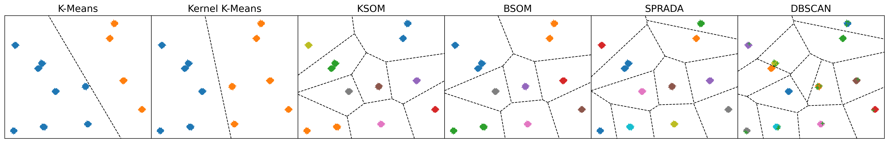

# Toolbox for ND data partitioning and evaluation

<h1 align="center">

</h1><br>


## Contents

1. [Description](#Description)
2. [Download](#Download)
3. [Installation](#Installation)
4. [Modules Description](#Modules-Description)
5. [Example of Usage](#Example-of-Usage)


## Description
The **clustering** package is a toolbox that provides tools to cluster sets of data in a blind Data-Mining context, where little or even no *a-piori* knowledge is accessible. It features three main parts:

1. **Wrappers**: classes to represent a set and a cluster of data, with the ND data themselves, but also their (time-)stamps and some additional contextual information; these classes help keep track of the data once they are distributed into the clusters.
2. **Clustering**: highly configurable classes and functions to cluster an ND dataset, using standard (e.g. K-Means, SOMs) and newly proposed (e.g. BSOMs, SPRADA) methods. Additional clustering methods from the Scikit-Learn suit can also be easily interfaced with the project.
3. **Evaluation**: metrics, linkage functions and quantifiers to evaluate the "quality" of a group of data in a blind context, with little *a-piori* knowledge on them. This includes the Dunn, Bouldin-Davies, Jaccard and Sorensen Indexes, the Silhouette Coefficients and some newly proposed methods such as the Hyper-Density.

This work was the first part of the research I carried out as part of my doctoral studies, whose dissertation (thesis) is publicly available
[here](https://theses.hal.science/tel-05295895).
For extensive explanations on and comparison of the methods implemented in this toolbox, refer to *Chapter 3 Clustering for Space Partitioning* of this dissertation, and for concrete examples of use in real industrial contexts, refer to *Chapter 5 Anomaly Detection and Classification in Industrial Contexts*.

The second part of the work investigated during my doctoral research deals with the multi-modeling of complex, dynamic industrial systems, and is made available as the
[`modeling`]()
package. Both projects have been made independent, but were originally conceived to work together: a dataset can first be clustered using tools from `clustering`, and then a multi-model can be built and trained on the so-issued clusters using the tools from `modeling`. Both packages can nonetheless be installed and used independently.

### Authors & Support
The project was developed at the Laboratoire Images, Signaux et Systèmes Intelligents (LISSI) of the University Paris-Est Créteil (UPEC), and is authored by:

- Dylan MOLINIE (main developer)
- Kurosh MADANI (ideas & reviews)

Contact Dylan MOLINIE (<dylan.molinie@gmx.fr>) for any query or support.

### Funding
This toolbox was part of the work developed for and delivered to the
[HyperCOG](https://www.hypercog.eu/)
project from the European Union's Horizon 2020 Research and Innovation Program (grant agreement No.869886); this project focused on the Industry 4.0's Cognitive Factory. 

### License
The project is distributed under GPLv3 license.


## Download

To download the project, either go to the project page:  
https://github.com/dmolinie/clustering

Or download it directly with the following command:

```bash
git clone https://github.com/dmolinie/clustering.git
```


## Installation
To install the `clustering` package, run the following command when in the package root folder:

```bash
pip install .
```

See the
[INSTALL.rst](INSTALL.rst)
file for further explanation on the requirements and options on installation.


## Modules Description
The different modules of the package are briefly described below. All the functions of every module with a short description for each of them are listed in the 
[MODULES.rst](MODULES.rst)
file.

* `cluster`  
    Tools to ease clustering and refine the obtained groups; also provide functions to save results (CSV export).

* `datasets`  
    Simple, academic datasets for testing purpose. These datasets are NumPy-based, and wrapped into the standard `Database` format of the project.

* `ecd`  
    Provide the ECD Test, a split-and-merge method to estimate the number of regions in a feature space using the Empirical Cumulative Distributions (ECDs). Also provide the Kolmogorov-Smirnov (KS) Test.

* `formats`  
    Wrappers for data and clusters; in particular, the features of any database is a set of data (y-values), their (time)stamps (x-values), the name of the columns and some contextual information. In addition, a cluster is a database with a characterizing pattern (its prototype). The `Database` and `Cluster` classes are conceived to represent ND time-series, in which the columns represent the sensors, and the rows, the samples over time. Finally, provide a wrapper to represent a Neural Grid in the sense of the Kohonen's SOMs (cf. module `ksom`).

* `kmeans`  
    Implement the regular and kernel-variant K-Means algorithm, and provide classes to use them as well as standalone functions to use them directly.

* `ksom`  
    Implement the Kohonen Self-Organizing Maps (SOMs or KSOMs), that are stochastic grids that learn classes from example. Also provide the Bi-Level SOMs, that are an improvement to the SOMs: they train several maps, and average them all using another, final SOM. For both SOMs and BSOMS, provide a class to use them as well as standalone shorthand functions.

* `metrics`  
    Provide standard distances, kernels and linkage functions. Also provide tools to rescale a dataset, compute statistics on it and metrics to characterize it, in particular the Silhouette Coefficients, the Hyper-Density (HyDen), the Average Standard Deviation (AvStd) and a hybrid mixture of them (HyDAS).

* `region_growing`  
    Interface the `DBSCAN` and `OPTICS` clustering methods from the `Scikit-Learn` suit to the format standard of the current project. In particular, this format allows using these classes in the `Recursive` and `SPRADA` classes from the `sprada` module.

* `sprada`  
    Provide the `Recursive` class that aims to decompose a dataset into many pieces until any group satisfies a given metric (compatness, homogeneity, density, etc.). Also provide the `SPRADA` class, that is a high-level clustering algorithm with a split-and-merge approach.

* `tools`  
    Provide general-purpose tools, in particular for data format or dictionary keys check, and for saving or loading data (I/O streams).


## Example of Use
Here is a an example of use of the main functionalities of the `clustering` package: it shows how to generate a small example dataset (automatically wrapped into the `Dataset` container that the project extensively uses) and cluster it using the implemented partitioning methods. It also shows how to use some of the data quantifiers provided by the project.

More detailed examples are provided in the `scripts` folder of the package sources.

```python
import numpy as np

from clustering import metrics as mts       # Data analysis tools
from clustering import ecd                  # KS & ECD Tests
from clustering import cluster as clt       # Data partitioning
from clustering import datasets as sets     # Example datasets


# Generate a simple dataset
database = sets.gaussian(250, 5, (0, 100), 0.5, 12)

#--------------------------   Data Partitioning   ---------------------------#
# In the following examples, the full sets of parameters for any clustering
# functions are explicitly provided, but one may provide only some of them,
# or even no parameter; in such a case, default values will be used. For any
# clustering function, a dedicated function that checks the set of parameters
# is made available in the same module as the one implementing the clustering
# function, e.g. `kmeans_params` from the `kmeans` module, where the `KMeans`
# clustering algorithm is implemented as a class and a standalone function.

# K-Means
kms_params = {
   'nb_clusters': 2, 'cluster': True, 'margins': 0.01, 'tmax': 100,
   'seed': None, 'verbose': True, 'distance': 'euclidean'}
clusters_kms = clt.cluster(
    database, method='kmeans', fuse=0., **kms_params)

# KSOM
ksom_params = {
    'grid_size': (3, 3), 'cluster': True, 'grid': False,
    'margins': 0.01, 'tmax': 1000, 'nbh_rate_0': 1.00,
    'lrn_rate_0': 0.95, 'seed': None, 'verbose': True,
    'distance': 'euclidean'}
clusters_ksom = clt.cluster(
    database, method='ksom', fuse=0., **ksom_params)

# BSOM
bsom_params = {
   'grid_size': (3, 3), 'nb_grids': 10, 'cluster': True,
   'grid': False, 'margins': 0.01, 'tmax': 1000,
   'nbh_rate_0': 1.00, 'lrn_rate_0': 0.95, 'seed': None,
   'verbose': True, 'distance': 'euclidean'}
clusters_bsom = clt.cluster(
    database, method='bsom', fuse=0., **bsom_params)

# DBSCAN (Scikit-Learn)
dbscan_params = {
   'eps': 0.5, 'min_samples': 5,
   'metric': 'minkowski', 'p': 2, 'cluster': True}
clusters_dbscan = clt.cluster(
    database, method='dbscan', fuse=0., **dbscan_params)
#----------------------------------------------------------------------------#

#-----------------------   Data Cluster Evaluation   ------------------------#
# Quantifiers & HyDAS
quant_params = {
    'span': 'sphere_span',
    'volume': 'hypersphere',
    'distance': 'euclidean'}
quants = mts.quantifiers(clusters_ksom, **quant_params)
score = mts.hydas(clusters_ksom, **quant_params)

# Indexes
j_idx = mts.jaccard_index(clusters_ksom[0], clusters_ksom[1])
s_idx = mts.sorensen_index(clusters_ksom[0], clusters_ksom[1])

# KS Test
ks_test = ecd.ks_test(clusters_ksom)
ks_test_dba = ecd.ks_test(clusters_ksom, database)
#----------------------------------------------------------------------------#
```
